## Wehelp Assignment Week 5 - MySQL

### 要求三 SQL CRUD
#### 1） 使⽤ INSERT 指令新增⼀筆資料到 member 資料表中，這筆資料的 username 和 password 欄位必須是 test。接著繼續新增⾄少 4 筆隨意的資料。

```
insert into member(name,username,password)values('test','test','test');

insert into member(name,username,password)values('iwawa','iwa','iwa');

insert into member(name,username,password)values('ochino','ochi','oc');

insert into member(name,username,password)values('puka','pukka','pukka');

insert into member(name,username,password)values('ada','adaa','adda');
```

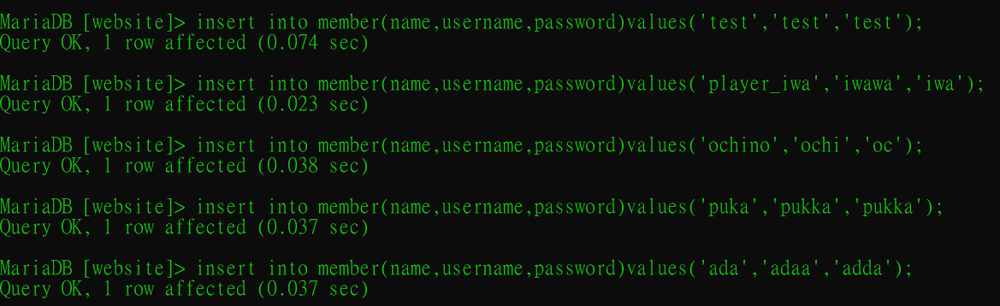

#### 2） 使⽤ SELECT 指令取得所有在 member 資料表中的會員資料。

```
select*from member;
```

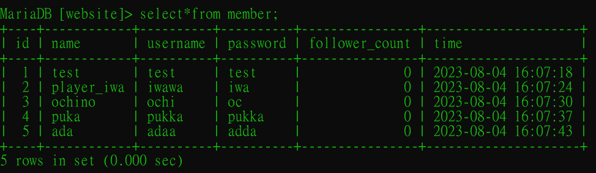

#### 3） 使⽤ SELECT 指令取得所有在 member 資料表中的會員資料，並按照 time 欄位，由近到遠排序。

```
select*from member order by time desc;
```

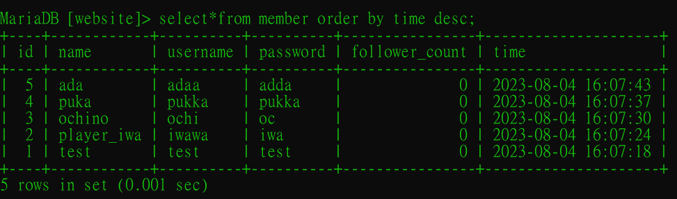

#### 4） 使⽤ SELECT 指令取得 member 資料表中第 2 到第 4 筆共三筆資料，並按照 time 欄位，由近到遠排序。( 並非編號 2、3、4 的資料，⽽是排序後的第 2 ~ 4 筆資料 )

```
select*from member order by time desc limit 1,3;
```

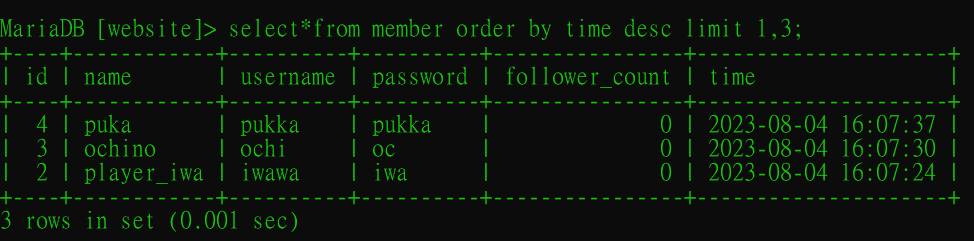

#### 5） 使⽤ SELECT 指令取得欄位 username 是 test 的會員資料。

```
select*from member where username='test';
```

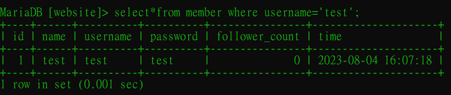

#### 6） 使⽤ SELECT 指令取得欄位 username 是 test、且欄位 password 也是 test 的資料。

```
select*from member where username='test' and password='test';
```

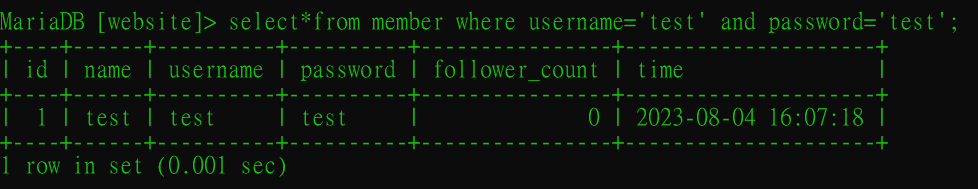

#### 7） 使⽤ UPDATE 指令更新欄位 username 是 test 的會員資料，將資料中的 name 欄位改成 test2。

```
update member set name='test2' where username='test';
```
結果如下（用select取得最新資料表）：

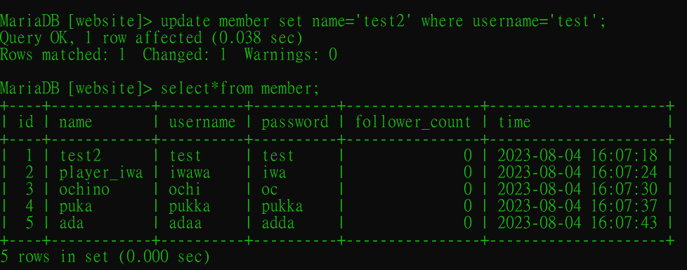

***

### 要求四 SQL Aggregate Functions

#### 1） 取得 member 資料表中，總共有幾筆資料 ( 幾位會員 )。

```
mysql> select count(name) from member;
```

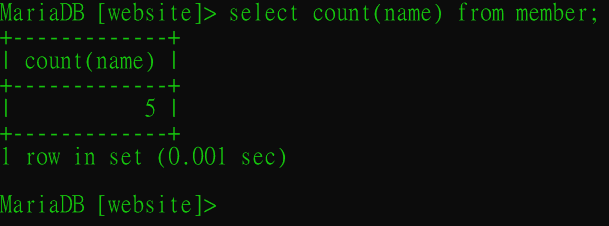

#### 2） 取得 member 資料表中，所有會員 follower_count 欄位的總和。

```
select sum(follower_count) from member;
```

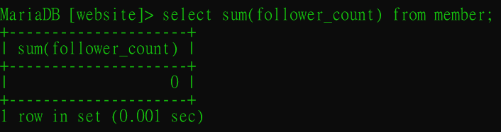

#### 3） 取得 member 資料表中，所有會員 follower_count 欄位的平均數。

```
select avg(follower_count) from member;
```

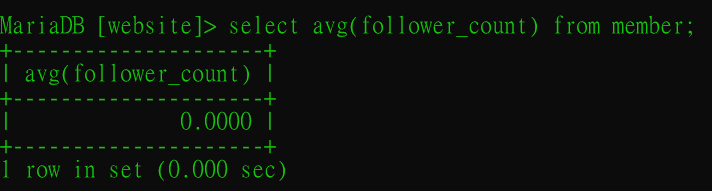

***

### 要求五 SQL JOIN

#### 1） 在資料庫中，建立新資料表紀錄留⾔資訊，取名字為 message。資料表中必須包含以下欄位設定：

```
create table message(
    -> id bigint primary key auto_increment,
    -> member_id bigint not null,
    -> content varchar(255) not null,
    -> like_count int unsigned not null default 0,
    -> time datetime not null default now()
    -> ); 

alter table message add foreign key(member_id) references member(id);
```

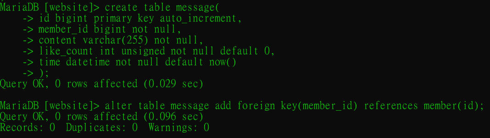

新增資料到message資料表中

```
insert into message(member_id,content)values(1,'哇 你超棒');

insert into message(member_id,content)values(2,'你那個武器是哪裏買的？');

insert into message(member_id,content)values(3,'我的裝扮有沒有很好看？但攻擊力其實一般 哈哈');

insert into message(member_id,content)values(4,'哎喲 我死了 等我復活再來');

insert into message(member_id,content)values(5,'哎 pukka 你的名字好可愛哦');
```

結果如下（用select取得最新資料表）：

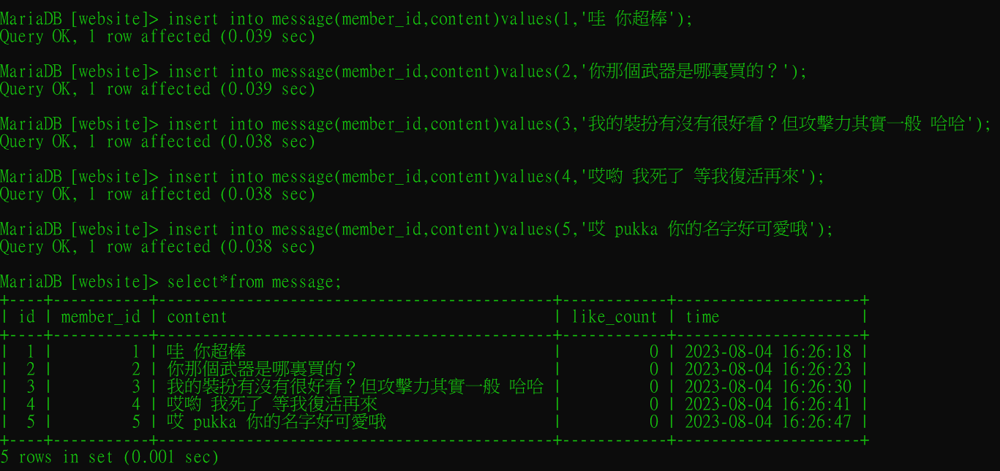

#### 2） 使⽤ SELECT 搭配 JOIN 語法，取得所有留⾔，結果須包含留⾔者的姓名。

```
select*from member inner join message on member.id=message.member_id;
```
熒幕太小，time都被擠到下一行去了，希望沒有要看的很辛苦>.<

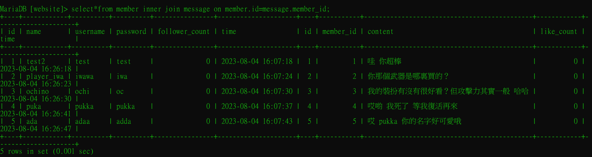

如果只想取得會員姓名，賬號名稱還有該用戶的留言，請看以下：

```
select member.name,member.username,message.content from member inner join message on member.id=message.member_id;
```

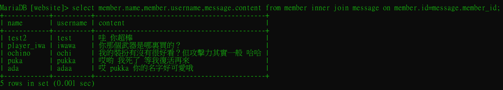

#### 3） 使⽤ SELECT 搭配 JOIN 語法，取得 member 資料表中欄位 username 是 test 的所有留⾔，資料中須包含留⾔者的姓名。 

```
select member.name,member.username,message.content from member inner join message on member.id=message.member_id where member.username='test';
```

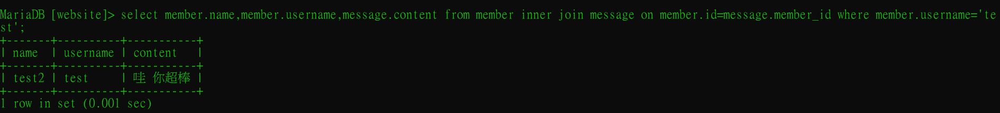

#### 4） 使⽤ SELECT、SQL Aggregate Functions 搭配 JOIN 語法，取得 member 資料表中欄位 username 是 test 的所有留⾔平均按讚數。

```
select member.username,avg(message.like_count) from member inner join message on member.id=message.member_id where member.username='test';
```

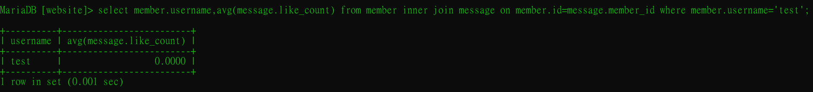